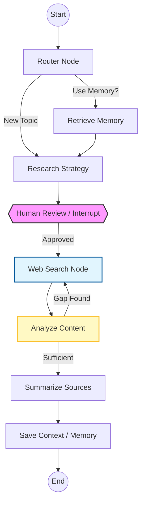

# Deep Research Agent

An advanced, autonomous research system built with **LangGraph**, designed to conduct deep-dive investigations into any topic. It features a multi-step iterative workflow, long-term memory, human-in-the-loop approval, and semantic indexing.

## 🚀 Key Features

- **Iterative Research Loop**: Automatically evaluates research quality and loops back for more information if gaps are found.
- **Human-In-The-Loop (HIL)**: Uses LangGraph `interrupt` to allow human approval/modification of research strategies and search queries before execution.
- **Long-Term Memory**: Persists research summaries across sessions using the LangGraph Server Store with **Semantic Search** (indexed via OpenAI).
- **Hybrid Vector Storage**: 
  - **Platform Store**: For long-term retrieval across different threads.
  - **Local Chroma DB**: For session-specific document retrieval using Ollama embeddings.
- **Advanced Tools**: Integrates with Tavily and DuckDuckGo for real-time web intelligence.

---

## 🏗️ System Architecture

### High-Level Workflow
The agent follows a sophisticated graph-based state machine:

1.  **Memory Router**: Searches the platform store for previous research on the topic.
2.  **Research Strategy**: Decomposes the topic into a search query plan based on complexity.
3.  **Human Review (Interrupt)**: Pauses execution for human approval of the research plan and queries.
4.  **Web Search**: Executes queries via Tavily/DDG and extracts content from relevant web pages.
5.  **Quality Evaluation**: A dedicated node analyzes gathered content against the original goal to identify knowledge gaps.
6.  **Summarization**: Synthesizes all findings into a structured Markdown report with citations.
7.  **Memory Save**: Indexes the final research in long-term memory for future retrieval.

### Visual Graph


---

## 🛠️ Components

### 1. Nodes (`src/agent/nodes/`)
- **`router_node`**: Uses semantic search to decide if we should leverage past research.
- **`review_research_node`**: Implements the `interrupt` logic for approval.
- **`evaluate_content`**: A Pydantic-driven node that performs gap analysis.
- **`save_context_node`**: Handles dual-writing to the Platform Store and local Chroma DB.

### 2. Memory System
The system utilizes LangGraph's advanced `BaseStore` with the following `langgraph.json` configuration:
```json
"store": {
  "index": {
    "embed": "openai:text-embedding-3-small", 
    "fields": ["summary", "first_name", "last_name"]
  }
}
```

---

## ⚙️ Configuration & Setup

### Prerequisites
- Python 3.10+
- [LangGraph CLI](https://github.com/langchain-ai/langgraph-cli)
- [Ollama](https://ollama.com/) (running locally)

### Environment Variables
Create a `.env` file:
```bash
# LLM Providers
OPENAI_API_KEY=sk-...
GROQ_API_KEY=gsk-...

# Search Tools
TAVILY_API_KEY=tvly-...

# Local Embeddings (Ollama)
OLLAMA_MODEL=nomic-embed-text:latest
```

### Installation
```bash
pip install -e .
```

### Running the Agent
To start the LangGraph development server:
```bash
langgraph dev
```

---

## 📄 Implementation Details

### 1. Advanced State Management
The `AgentState` uses LangGraph's **Reducers** to handle information accumulation during the iterative loop:
- **`past_queries`**: Uses `Annotated[list[str], operator.add]` to maintain a full history of all search terms tried across loops, preventing redundant work.
- **`source_documents`**: Uses `operator.add` to append new web content snippets to the existing knowledge base without overwriting previous findings.

### 2. Structured Intelligence (Pydantic)
The agent relies on structured output for deterministic control flow:
- **`SearchQueryPlan`**: Classifies request complexity and generates an optimized list of queries.
- **`ContentEvaluation`**: Performs a rigorous check for "definitions, data density, context, and actionability." If insufficient, it provides a list of `next_search_queries` to fill the identified gaps.

### 3. Hybrid Memory & Indexing
The system implements a dual-layer memory strategy:
- **LangGraph Store (Persistent)**: Uses the `runtime.store` for cross-session long-term memory. It is semantically indexed via `openai:text-embedding-3-small`.
- **Local Chroma DB**: Used for high-speed, session-specific RAG (Retrieval-Augmented Generation). It utilizes `OllamaEmbeddings` (`nomic-embed-text`) to chunk and index full summaries for local retrieval.

### 4. Human-In-The-Loop (HIL)
Security and quality are maintained through the `interrupt` pattern:
- The graph pauses at the `review_research_node`.
- It exposes the proposed search queries and research strategy to the user.
- The user can **Approve**, **Reject**, or **Modify** the queries before the agent proceeds to the expensive web search phase.

### 5. Web Intelligence
- **Tavily Search**: Optimized for LLM consumption, returning clean snippets and page content.
- **DuckDuckGo**: Fallback search engine for enhanced reliability.
- **Filtering**: Intelligent filtering of PDF links and non-textual assets to ensure data quality.

---

## 🔮 Future Roadmap
- [ ] Integration with local PDF/Document processing.
- [ ] Multi-agent collaboration for deeper domain specialization.
- [ ] Direct export to Notion/Google Docs.
