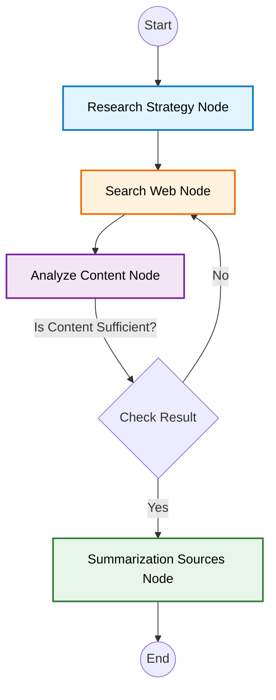

# System Design Document: Research Agent

## 1. Executive Summary
The Research Agent is an intelligent system designed to conduct deep, automated research on a given topic. Built using LangGraph, it orchestrates a workflow of specialized agents to generate search queries, gather information from the web, key claims and gaps, and synthesize a comprehensive report.

## 2. System Architecture

### 2.1 High-Level Overview
The system follows a state-based graph architecture (StateGraph) where specialized nodes perform distinct tasks. The workflow is iterative, allowing the agent to refine its research until sufficient information is gathered.

### 2.2 Core Technologies
- **LangGraph**: Orchestrates the agent workflow and state management.
- **LangChain**: Provides the framework for LLM interactions and chains.
- **Ollama**: Interfaces with local LLMs (DeepSeek-R1) for reasoning and content generation.
- **Tavily / DuckDuckGo**: External search engines for web data retrieval.
- **Pydantic**: data validation and structured output parsing.

## 3. Data Flow & State Management

### 3.1 Agent State
The system maintains a shared state object (`AgentState`) passed between nodes:
```python
class AgentState(TypedDict):
    topic: str                  # Original user query/topic
    generated_queries: list[str]# Current list of search queries to execute
    past_queries: list[str]     # History of queries to avoid duplication
    source_documents: list[dict]# Accumulated research content
    final_summary: str          # The generated final report
    evaluation_result: bool     # Outcome of the content sufficiency check
```

### 3.2 Workflow (The Graph)
1.  **Start → Research Strategy Node**: Analyzes the user's topic to determine complexity and generates an initial query plan (simple vs. complex).
2.  **Research Strategy Node → Search Web Node**: Executes the planned search queries using external search tools.
3.  **Search Web Node → Analyze Content Node**:
    *   Formats the retrieved web content.
    *   Evaluates if the information is sufficient to write a full report.
    *   Identifies knowledge gaps and missing details.
4.  **Analyze Content Node (Conditional Edge)**:
    *   **If Sufficient (`evaluation_result` is True)** → Transition to **Summarization Sources Node**.
    *   **If Insufficient** → Loop back to **Search Web Node** (or potentially a query refinement step, though currently, the graph loops back to `search_web_node` potentially reusing queries or needing a dedicated query generator in the loop). *Note: The current graph implementation loops `search_web_node` directly or via a check. The provided code shows a conditional edge from `analyze_content_node` to either `summarization_sources` or `search_web_node` based on `evaluation_result`.*
5.  **Summarization Sources Node**: Synthesizes all gathered content into a final markdown report.
6.  **End**: Output the final summary.

### 3.3 Visual Workflow


## 4. Component Design

### 4.1 Nodes (`src/agent/nodes/`)
*   **`research_strategy_node`**:
    *   **Input**: `topic`
    *   **Process**: Uses `Research Strategist Chain` to classify the query complexity and generate an optimized `SearchQueryPlan`.
    *   **Output**: Updates `generated_queries`.

*   **`search_web_node`**:
    *   **Input**: `generated_queries`
    *   **Process**: Calls `tavily_search` (or DDG) to fetch web pages. Handles simple pdf filtering and uses `WebBaseLoader` for content extraction.
    *   **Output**: Updates `source_documents`.

*   **`analyze_content_node`**:
    *   **Input**: `source_documents`, `topic`
    *   **Process**: Uses `Evaluate Content Chain` to rigorous gap analysis. It checks for definitions, data density, context, and actionability.
    *   **Output**: Updates `evaluation_result`.

*   **`summarization_sources`**:
    *   **Input**: `source_documents`, `topic`
    *   **Process**: Uses `Summarize Sources Chain` to write a structured, multi-section research report with citations.
    *   **Output**: Updates `final_summary`.

### 4.2 Chains (`src/agent/chains/`)
*   **`Research Strategist Chain`**: Decomposes queries into sub-queries for complex topics.
*   **`Evaluate Content Chain`**: Structured evaluation (Pydantic model) returning `is_sufficient` and `reasoning`.
*   **`Generate Query Chain`**: (Legacy/Alternative) Generates queries based on past context.
*   **`Summarize Sources Chain`**: Standard context-stuffing generic summarizer.

### 4.3 Utilities (`src/agent/utils/`)
*   **`search.py`**: Wrappers for Tavily and DuckDuckGo APIs. Includes error handling for web scrappers (`fetch_webpage_using_webloader`).
*   **`common.py`**: Helper functions to format documents for LLM context.

## 5. External Interface
*   **Input**: A string representing the research topic.
*   **Output**: A dictionary containing the `final_summary` (Markdown string).

## 6. Future Improvements (Potential)
*   **Dynamic Loop**: The current `analyze_content_node` -> `search_web_node` loop might need a `generate_new_queries_node` in between to create *new* queries based on the identified gaps, rather than just re-running search (unless `generated_queries` is updated inside `analyze_content` or a separate step).
*   **Memory Integration**: Better tracking of `past_queries` to ensure diverse search angles.
