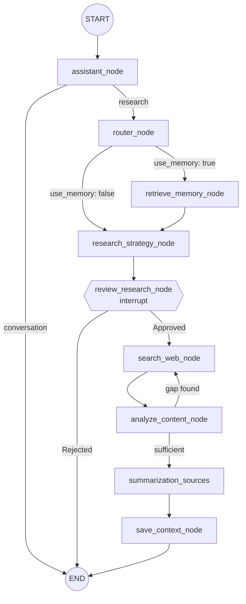

<div align="center">

# Deep Research Agent

**An autonomous research agent built on LangGraph that plans, retrieves, self-evaluates, and synthesizes deep research reports from the open web.**

[](https://www.python.org/)
[](https://github.com/langchain-ai/langgraph)
[](LICENSE)
[](frontend/)

</div>

---

## Table of contents

- [What it does](#what-it-does)
- [Why this exists](#why-this-exists)
- [Key features](#key-features)
- [Architecture](#architecture)
- [How a research run flows](#how-a-research-run-flows)
- [Tech stack](#tech-stack)
- [Quickstart](#quickstart)
- [Project layout](#project-layout)
- [Configuration](#configuration)
- [Extending the agent](#extending-the-agent)
- [Testing](#testing)
- [Roadmap](#roadmap)
- [Further reading (wiki)](#further-reading-wiki)
- [Contributing](#contributing)
- [License](#license)

---

## What it does

You give the agent a topic. It:

1. Checks long-term memory to see if it has researched something similar before.
2. Decomposes the topic into a search plan (a set of focused queries).
3. Pauses for **human approval** of the plan before spending tokens.
4. Searches the web (Tavily primary, DuckDuckGo fallback), fetches pages, and converts them to clean Markdown.
5. **Evaluates its own retrieved context** against the original topic. If it finds gaps, it generates new queries and loops back to search again.
6. Synthesizes everything into a structured Markdown report with citations.
7. Saves the result into a hybrid memory layer so the next related question is faster and cheaper.

The whole thing runs as a typed [LangGraph](https://github.com/langchain-ai/langgraph) state machine and ships with a React 19 + Vite chat UI.

---

## Why this exists

Naive RAG-style "chat with the web" pipelines do a single retrieve→generate pass. That works for shallow questions and breaks on hard ones, because the answer is rarely in one chunk and the first retrieval rarely surfaces the right chunk.

This project implements the **deep research loop**: *plan → retrieve → evaluate gaps → re-plan → re-retrieve → synthesize*. It's the same architectural shape used by hosted deep-research products, built on open infrastructure you can run locally.

It's also a working reference for several LangGraph patterns that are easier to talk about than to wire up:

- Typed state with `Annotated[..., operator.add]` reducers for loop accumulation
- Pydantic-constrained node outputs for deterministic control flow
- The `interrupt` primitive for human-in-the-loop checkpoints
- A hybrid memory layer that combines the LangGraph Store with a local Chroma vector DB

---

## Key features

| | |
|---|---|
| **Iterative research loop** | The `analyze_content_node` performs gap analysis and decides whether to loop back to web search or proceed to summarization. |
| **Human-in-the-loop** | `review_research_node` uses LangGraph's `interrupt` to expose the proposed query plan for approval/modification before any web call. |
| **Hybrid memory** | Local **Chroma** (Ollama embeddings, `nomic-embed-text`) for session-scoped RAG over past summaries, plus the **LangGraph Store** (OpenAI `text-embedding-3-small`) for cross-thread long-term memory. |
| **Structured outputs** | Every LLM call uses Pydantic schemas (`SearchQueryPlan`, `ContentEvaluation`, `AssistantDecision`, etc.) — no regex on free text. |
| **Conversation vs research routing** | An entry-point `assistant_node` decides whether the message warrants research or a direct chat reply, so casual messages don't trigger expensive runs. |
| **Resilient web tier** | Tavily as primary, DuckDuckGo as fallback, with PDF filtering, custom UA headers, and Markdown conversion via `markdownify`. |
| **Chat UI** | React 19 + Vite + Tailwind frontend wired to the LangGraph runtime via `@langchain/langgraph-sdk`. |
| **First-class tests** | Unit and integration test layout, plus a dedicated memory-flow test. |

---

## Architecture

### High-level graph


```mermaid
flowchart TD
    START((START)) --> AST[assistant_node]
    AST -- conversation --> END((END))
    AST -- research --> ROUTER[router_node]

    ROUTER -- use_memory: true --> RET[retrieve_memory_node]
    ROUTER -- use_memory: false --> STRAT[research_strategy_node]
    RET --> STRAT

    STRAT --> REV{{review_research_node<br/>interrupt}}
    REV -- Approved --> SEARCH[search_web_node]
    REV -- Rejected --> END

    SEARCH --> ANA[analyze_content_node]
    ANA -- gap found --> SEARCH
    ANA -- sufficient --> SUM[summarization_sources]

    SUM --> SAVE[save_context_node]
    SAVE --> END
```

A snapshot of the compiled graph (rendered from LangGraph Studio) is committed at [`graph_image.png`](graph_image.png), and a Studio screenshot at [`static/studio_ui.png`](static/studio_ui.png).

### Nodes

| Node | File | Responsibility |
|---|---|---|
| `assistant_node` | `src/agent/nodes/assistant_node.py` | Routes the incoming message to either a direct conversational reply or the research subgraph. |
| `router_node` | `src/agent/nodes/router_node.py` | Searches the LangGraph Store for prior research on the topic and sets `use_memory`. |
| `retrieve_memory_node` | `src/agent/nodes/retrieve_memory_node.py` | When `use_memory` is true, fetches relevant past summaries from local Chroma. |
| `research_strategy_node` | `src/agent/nodes/generate_query.py` | Generates a `SearchQueryPlan` — a typed list of search queries scaled to topic complexity. |
| `review_research_node` | `src/agent/nodes/review_research_node.py` | Calls `interrupt(...)` to pause for human approval/edit of the plan. |
| `search_web_node` | `src/agent/nodes/web_search.py` | Executes queries via Tavily (with DuckDuckGo as a backup utility), loads pages with `WebBaseLoader`, filters PDFs. |
| `analyze_content_node` | `src/agent/nodes/evaluate_content.py` | Produces a `ContentEvaluation`: `is_sufficient` + `next_search_queries` for the next loop. |
| `summarization_sources` | `src/agent/nodes/summarize_sources.py` | Synthesizes a final Markdown report with inline citations. |
| `save_context_node` | `src/agent/nodes/save_context_node.py` | Dual-writes: persists summary to local Chroma **and** writes a short summary to the LangGraph Store namespaced under `("research",)`. |

### Shared state

`src/agent/states/agent_state.py` defines the typed state. The two fields that accumulate across loops use `operator.add` reducers:

```python
class AgentState(TypedDict):
    messages: Annotated[list[BaseMessage], add_messages]
    topic: str
    generated_queries: list[str]
    past_queries: Annotated[list[str], operator.add]          # appended every loop
    source_documents: Annotated[list[dict[str, str]], operator.add]  # appended every loop
    final_topic: str
    final_summary: str
    memory_summary: str
    memory_context: str
    use_memory: bool
    start_research: bool
    evaluation_result: bool
    next_node: str
```

`past_queries` prevents the planner from re-issuing queries it already tried. `source_documents` builds up the full evidence base across iterations rather than overwriting on each retrieval.

---

## How a research run flows

Here's what actually happens, end-to-end, when you ask *"Compare LangGraph and CrewAI for agentic RAG pipelines"*:

1. **`assistant_node`** classifies the message as research (not chitchat), extracts the topic, and routes to `router_node`.
2. **`router_node`** semantic-searches the LangGraph Store under namespace `("research",)`. It hands the matches to `memory_router_chain`, which decides whether prior research is close enough to reuse. Output: `use_memory: bool`.
3. If `use_memory`, **`retrieve_memory_node`** does a similarity search over the local Chroma collection `research_memory` and stuffs the top-k summaries into `memory_context`.
4. **`research_strategy_node`** prompts the planner LLM with the topic (and `memory_context`, if any) and emits a `SearchQueryPlan` — complexity tag plus a list of focused queries.
5. **`review_research_node`** fires `interrupt(...)`. The graph pauses; the UI shows the proposed queries. The user can `Approve`, `Reject`, or send back edited queries. Rejection short-circuits to `END`.
6. **`search_web_node`** runs `tavily_search` over the approved queries, fetches each result with `WebBaseLoader`, drops PDFs, and appends normalized records to `source_documents`.
7. **`analyze_content_node`** invokes `evaluate_content_chain`, which scores the gathered context against the topic and returns a `ContentEvaluation`. If `is_sufficient` is false, it emits `next_search_queries`; the graph loops back to `search_web_node` with those.
8. Once sufficient, **`summarization_sources`** generates the final Markdown report.
9. **`save_context_node`** chunks and writes the summary to Chroma (1000-token chunks, 100-token overlap) and writes a compact summary to the LangGraph Store keyed by topic.

A more detailed narrative for each phase lives in the [wiki](#further-reading-wiki).

---

## Tech stack

**Orchestration**
- [LangGraph](https://github.com/langchain-ai/langgraph) `>=1.0.5` — typed graph + checkpointing + Store + `interrupt`
- [LangChain](https://github.com/langchain-ai/langchain) `>=1.2.0` — chains, prompts, structured outputs

**Models (default: OpenAI GPT-5)**
- Chat / reasoning: `gpt-5-nano` across all chains (`assistant`, `memory_router`, `research_strategist`, `evaluate_content`, `summarize_sources`)
- Store embeddings: `openai:text-embedding-3-small` (configured in `langgraph.json`)
- Local embeddings (Chroma): `nomic-embed-text` via Ollama
- Optional providers wired through `langchain-groq` and `langchain-ollama` for easy swapping

**Web intelligence**
- [Tavily](https://tavily.com/) — primary search, LLM-optimized snippets
- [DuckDuckGo (`ddgs`)](https://github.com/deedy5/ddgs) — fallback search
- `langchain-community` `WebBaseLoader` for page fetch
- `markdownify` + `beautifulsoup4` for HTML→Markdown normalization

**Memory**
- LangGraph Store (semantic-indexed) for cross-session persistence
- [Chroma](https://www.trychroma.com/) (`langchain-chroma`) for session/local RAG

**Frontend**
- React 19, Vite 7, TailwindCSS 4, `react-markdown`
- [`@langchain/langgraph-sdk`](https://www.npmjs.com/package/@langchain/langgraph-sdk) for streaming graph runs and handling `interrupt` events

**Dev**
- `pytest`, `mypy --strict`, `ruff` (lint + format), Makefile entrypoints

---

## Quickstart

### Prerequisites

- Python **3.10+**
- Node **18+** (for the frontend)
- [`uv`](https://github.com/astral-sh/uv) (recommended) or `pip`
- The [LangGraph CLI](https://github.com/langchain-ai/langgraph-cli) — `pip install -U "langgraph-cli[inmem]"`
- [Ollama](https://ollama.com/) running locally, with `nomic-embed-text` pulled:
  ```bash
  ollama pull nomic-embed-text
  ```
- API keys for OpenAI and Tavily

### 1. Clone and install

```bash
git clone https://github.com/<you>/research_agent.git
cd research_agent

# Recommended: uv
uv sync

# Or: classic pip
pip install -e .
```

### 2. Configure environment

Create a `.env` file in the project root:

```bash
# LLM
OPENAI_API_KEY=sk-...

# Web search
TAVILY_API_KEY=tvly-...

# Optional alternate providers
GROQ_API_KEY=gsk-...

# LangSmith tracing (optional but very nice for debugging)
LANGSMITH_API_KEY=ls-...
LANGSMITH_TRACING=true
LANGSMITH_PROJECT=deep-research-agent
```

### 3. Run the backend

The graph is exposed via the LangGraph dev server (defined in `langgraph.json`):

```bash
langgraph dev
```

This boots:
- The graph runtime on `http://127.0.0.1:2024`
- LangGraph Studio at the URL printed in the terminal — the easiest way to inspect a run

### 4. Run the frontend (optional but recommended)

```bash
cd frontend
npm install
npm run dev
```

The Vite dev server defaults to `http://localhost:5173`. It connects to the LangGraph server via the SDK and handles streaming + `interrupt` UI for the human-in-the-loop step.

---

## Project layout

```
research_agent/
├── src/agent/
│   ├── graph.py                 # The compiled LangGraph (entry point)
│   ├── nodes/                   # One file per graph node
│   │   ├── assistant_node.py
│   │   ├── router_node.py
│   │   ├── retrieve_memory_node.py
│   │   ├── generate_query.py    # research_strategy_node
│   │   ├── review_research_node.py
│   │   ├── web_search.py
│   │   ├── evaluate_content.py  # gap-analysis loop controller
│   │   ├── summarize_sources.py
│   │   └── save_context_node.py
│   ├── chains/                  # LLM chains used by nodes (Pydantic-typed)
│   │   ├── assistant_chain.py
│   │   ├── memory_router.py
│   │   ├── research_strategist.py
│   │   ├── generate_query_chain.py
│   │   ├── evaluate_content_chain.py
│   │   └── summarize_sources.py
│   ├── prompts/prompts.py       # All system prompts in one place
│   ├── states/agent_state.py    # Typed AgentState + reducers
│   └── utils/
│       ├── search.py            # Tavily + DuckDuckGo + page fetcher
│       ├── memory.py            # Chroma + Ollama embeddings helpers
│       └── common.py            # Formatters, helpers
├── frontend/                    # React 19 + Vite chat UI
│   ├── src/App.jsx
│   └── package.json
├── tests/
│   ├── unit_tests/
│   ├── integration_tests/
│   └── test_memory_flow.py
├── wiki/                        # Long-form design docs (see below)
├── langgraph.json               # Graph + Store + env config
├── pyproject.toml
├── Makefile
└── README.md
```

---

## Configuration

### Switching the LLM

Each chain file declares its own LLM at the top, e.g. `src/agent/chains/research_strategist.py`:

```python
# llm = ChatOllama(model='deepseek-r1:8b', reasoning=True, temperature=0)
# llm = ChatGroq(model="openai/gpt-oss-120b", temperature=0)
llm = ChatOpenAI(model='gpt-5-nano', temperature=0)
```

To swap providers globally, replace the `ChatOpenAI(...)` line in each chain (Groq and Ollama variants are pre-imported and commented out as references). The structured-output contract (`with_structured_output(...)`) is provider-agnostic as long as the model supports tool calls / JSON mode.

### Memory layer

Two independent layers, each with its own purpose:

- **LangGraph Store** — configured in `langgraph.json` under `"store.index"`. Indexed with `openai:text-embedding-3-small` over the `summary`, `first_name`, `last_name` fields. Used by `router_node` to decide whether to reuse prior research, and written by `save_context_node` for cross-thread persistence.
- **Local Chroma** — `src/agent/utils/memory.py`. Persists to `./chroma_db`, collection `research_memory`. Uses Ollama (`nomic-embed-text`) embeddings. Used by `retrieve_memory_node` for high-fidelity recall of past summaries.

The dual-write happens in `save_context_node.save_context_node`:

```python
save_to_vector_db(topic, summary)       # Chroma
memory.put(                             # LangGraph Store
    namespace=("research",),
    key=topic,
    value={"summary": memory_summary},
)
```

### Web search providers

`src/agent/utils/search.py` exposes both `tavily_search` and `duckduckgo_web_search`. The default node uses Tavily; flip it inside `web_search.py` to switch:

```python
def search_web_node(state: AgentState):
    queries = state['generated_queries']
    results = tavily_search(queries)        # ← swap to duckduckgo_web_search(queries)
    return {'source_documents': results}
```

### Tuning the loop

Two knobs matter for the gap-analysis loop:

- The **complexity classification** in `SearchQueryPlan` controls how many queries are generated per round.
- The **`ContentEvaluation` prompt** in `evaluate_content_chain.py` controls how strict the gap evaluator is. Stricter → more loops → more cost and depth.

If you want a hard cap on loops, add a counter to `AgentState` and short-circuit in `should_search_web` when it exceeds a threshold.

---

## Extending the agent

Adding a new node follows a consistent shape:

1. **Write the chain** in `src/agent/chains/` with a Pydantic output schema and `with_structured_output(...)`.
2. **Write the node** in `src/agent/nodes/` — a function `def my_node(state: AgentState) -> dict[str, Any]:` that returns a partial state update.
3. **Register and wire** it in `src/agent/graph.py` via `.add_node(...)` and either `.add_edge(...)` or `.add_conditional_edges(...)`.

A minimal node template:

```python
# src/agent/nodes/my_node.py
from typing import Any
from src.agent.states.agent_state import AgentState
from src.agent.chains.my_chain import my_chain

def my_node(state: AgentState) -> dict[str, Any]:
    result = my_chain().invoke({"topic": state["topic"]})
    return {"some_field": result.some_field}
```

And the wire-up:

```python
graph = (
    StateGraph(AgentState)
    # ...existing nodes...
    .add_node(my_node)
    .add_edge("summarization_sources", "my_node")
    .add_edge("my_node", "save_context_node")
    .compile(name="ResearchAgent")
)
```

---

## Testing

```bash
# unit tests
make test

# integration tests
make integration_tests

# memory flow end-to-end
pytest tests/test_memory_flow.py -v

# lint + type-check
make lint

# format
make format
```

`tests/conftest.py` wires fixtures for the LangGraph runtime; `tests/integration_tests/test_graph.py` exercises the compiled graph; `tests/test_memory_flow.py` verifies the dual-write and retrieval through both memory layers.

---

## Roadmap

- [ ] Hard cap on gap-evaluation loop iterations with explicit fallback
- [ ] Local PDF / document ingestion as a first-class source
- [ ] Multi-agent collaboration for domain specialization (researcher / critic / synthesizer)
- [ ] Direct export of final report to Notion / Google Docs
- [ ] Streaming Markdown rendering in the frontend with token-level highlighting
- [ ] LangSmith eval suite for retrieval quality and citation faithfulness
- [ ] Cost / token telemetry per run

---

## Further reading (wiki)

The `wiki/` folder contains design-level write-ups that go deeper than this README:

- [`Home.md`](wiki/Home.md) — project overview
- [`The-Research-Graph.md`](wiki/The-Research-Graph.md) — node-by-node walkthrough of the graph
- [`Gap-Analysis-and-Self-Correction.md`](wiki/Gap-Analysis-and-Self-Correction.md) — how the evaluate→loop pattern is implemented
- [`Human-in-the-loop.md`](wiki/Human-in-the-loop.md) — the `interrupt` flow and UI contract
- [`Advanced-Memory.md`](wiki/Advanced-Memory.md) — Store + Chroma hybrid memory rationale
- [`Persistence-and-Thread-Management.md`](wiki/Persistence-and-Thread-Management.md) — checkpointing, threads, resume semantics

---

## Contributing

Contributions welcome. Before opening a PR:

1. `make lint` passes (`ruff` + `mypy --strict`)
2. `make test` passes
3. New nodes follow the three-step pattern in [Extending the agent](#extending-the-agent)
4. Public chains expose Pydantic schemas, not free-text outputs

For larger changes (new graph topology, new memory layer, new provider integration), please open an issue first to discuss the design.

---

## License

[MIT](LICENSE)

---

## Acknowledgments

- Built on [LangGraph](https://github.com/langchain-ai/langgraph) and [LangChain](https://github.com/langchain-ai/langchain)
- Web intelligence via [Tavily](https://tavily.com/) and [DuckDuckGo](https://duckduckgo.com/)
- Local embeddings via [Ollama](https://ollama.com/) (`nomic-embed-text`)
- Vector storage via [Chroma](https://www.trychroma.com/)
- Inspired by the open-source deep-research agent patterns from the LangChain community
